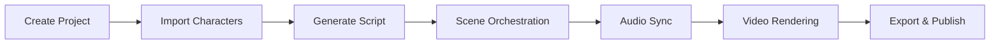

# StoryForge - Production Engine Architecture

> **Sisters of the Diaspora** - Legacy-grade reality TV automation

## 🎭 System Overview

StoryForge is a cinematic operating system for producing Netflix-quality reality TV content with AI-powered automation, featuring Lucky (@djluckluck) and the full cast.

---

## 🏗️ Backend Architecture

### **Lovable Cloud Infrastructure**

| Component | Technology | Purpose |
|-----------|-----------|---------|
| **Framework** | Supabase Edge Functions (Deno) | Serverless backend logic |
| **Auth** | Supabase Auth (JWT) | User authentication |
| **Database** | PostgreSQL + RLS | Data persistence & security |
| **Storage** | Supabase Storage (S3) | Video & asset storage |
| **Real-time** | Supabase Realtime | Cast triggers, remix events |
| **AI** | Lovable AI Gateway | Gemini 2.5 Flash models |

### **Video Engine Stack**

```yaml
renderer: FFmpeg + GPU acceleration
parallelism: Frame-level bot threads (8 concurrent max)
overlays: JSON-driven confessionals, cast reactions
audioSync: Suno track relevance triggers (@djluckluck)
export: MP4 + remix metadata
```

---

## 🤖 Bot Ecosystem

### **Production Bots**
1. **Episode Producer** - Orchestrates full production pipeline
2. **Script Generator** - AI-powered episode scripts
3. **Scene Orchestration** - Scene sequencing & timing
4. **Ultra Video Bot** - Parallel frame generation
5. **FFmpeg Video Engine** - Final video compilation

### **Character & Audio Bots**
6. **Confessional Logic Bot** - Character-driven confessionals
7. **Suno Audio Sync Bot** - Automatic music overlay
8. **Godlike Voice Bot** - TTS with emotional range

### **Viral Optimization Bots**
9. **Trend Detection Bot** - TikTok viral trend integration
10. **Performance Optimizer Bot** - A/B testing & metrics
11. **Hook Optimization Bot** - Titles, thumbnails, CTR
12. **Cultural Injection Bot** - Cultural relevance

### **Support Bots**
13. **Expert Director** - Scene direction
14. **Remix Bot** - Content remixing (meme, duet, reaction)
15. **Cross-Platform Poster** - Multi-platform publishing
16. **Self-Healing Bot** - Error recovery

---

## 🎵 Lucky's Character Schema

### **Core Profile**
```typescript
{
  character: "Lucky",
  handle: "@djluckluck",
  role: "Founder, Artist, Chaos Architect",
  vibe: "Legacy-grade, culturally fluent, remix-obsessed, chaos-native"
}
```

### **Suno Audio Triggers**
1. **"Say Less"** - Confident/dismissive moments
2. **"Better Than You"** - Competitive energy
3. **"You're a Hater"** - Confrontational scenes
4. **"All Out of Love"** - Emotional vulnerability
5. **"Hot Sauce"** - Spicy drama escalation
6. **"Low Key Bussin"** - Celebratory wins
7. **"Do Need Half Way Love"** - Longing/authentic

### **Confessional Logic**
- **Setting**: Architectural space with statement pieces
- **Lighting**: Power lighting with cultural artifacts
- **Energy**: Visionary architect meets cultural disruptor
- **Style**: Power suits, designer headwrap, commanding presence

### **Remix Archive**
- **Voice Patterns**: "When they said [X], I said [elevated Y]"
- **Visual Signature**: Rich espresso skin, architectural aesthetic
- **Narrative Arcs**: Underdog to empire builder

---

## 📦 Version Control & GitHub Integration

### **Repository Structure**
```
github.com/lucky/storyforge
├── main             # Production episodes
├── chaos-edits      # Experimental cuts
└── cast-overlays    # Confessional overlays
```

### **GitHub Actions Pipeline**
- **On Push to `chaos-edits` or `cast-overlays`**:
  - Auto-trigger Remix Bot
  - Sync remix metadata to database
  - Send cast notifications via Realtime

- **On Push to `main`**:
  - Deploy to production
  - Update episode status

### **Bidirectional Sync**
- ✅ Changes in Lovable → Auto-push to GitHub
- ✅ Changes in GitHub → Auto-sync to Lovable
- ✅ Real-time collaboration support

---

## 🎬 Production Workflow

### **Episode Creation Pipeline**



### **Parallel Production Phases**

**Phase 1**: Independent Tasks (Parallel)
- Script generation
- Hook optimization
- Trend detection
- Confessional logic

**Phase 2**: Enhancement (Parallel)
- Cultural injection
- Expert direction
- Viral optimization

**Phase 3**: Assembly (Parallel)
- Scene orchestration
- Suno audio sync

**Phase 4**: Rendering (Background)
- Frame generation
- FFmpeg video compilation

### **Timeline**
- Script generation: ~10s
- Scene orchestration: ~15s
- Video rendering: ~30-60s
- **Total**: Sub-minute production ⚡

---

## 🎯 FFmpeg Video Engine

### **Configuration JSON**
```json
{
  "parallelism": {
    "enabled": true,
    "threads": 8,
    "frameLevel": true
  },
  "export": {
    "format": "mp4",
    "codec": "h264",
    "gpuAcceleration": true,
    "preset": "fast",
    "crf": 23,
    "resolution": "1920x1080",
    "fps": 30
  },
  "overlays": {
    "confessional": {},
    "castReaction": {},
    "sunoTrack": {}
  }
}
```

### **Processing Flow**
1. Download frames from storage
2. Apply JSON-driven overlays
3. Sync Suno audio tracks (fade in/out)
4. Parallel frame processing (8 threads)
5. GPU-accelerated encoding
6. Export MP4 + remix metadata

---

## 📊 Database Schema

### **Core Tables**
- `projects` - Show projects & themes
- `characters` - Cast with full StoryForge schemas
- `episodes` - Episode data, status, video URLs
- `bot_activities` - Bot execution tracking
- `performance_metrics` - Viral analytics
- `media_assets` - Video & audio storage

### **Security**
- Row Level Security (RLS) on all tables
- JWT-based authentication
- Secure storage bucket policies
- Edge function authorization

---

## 🚀 Deployment

### **Production Environment**
- **Hosting**: Lovable Cloud (auto-deployed)
- **CDN**: Global edge network
- **Domain**: Custom domain support
- **SSL**: Automatic HTTPS

### **Self-Hosting Option**
1. Connect to GitHub
2. Clone repository
3. Deploy to preferred infrastructure
4. Configure environment variables
5. Continue using Lovable for development

---

## 🔧 Technologies

### **Frontend**
- React 18
- TypeScript
- Tailwind CSS
- shadcn/ui components

### **Backend**
- Supabase Edge Functions
- PostgreSQL
- Deno runtime

### **AI & Media**
- Lovable AI (Gemini 2.5 Flash)
- FFmpeg with GPU acceleration
- Suno audio integration

### **DevOps**
- GitHub Actions
- Supabase Realtime
- Automated deployments

---

## 📝 Getting Started

### **Local Development**
```bash
# Clone repository
git clone https://github.com/lucky/storyforge.git
cd storyforge

# Install dependencies
npm install

# Run locally
npm run dev
```

### **Environment Setup**
```env
VITE_SUPABASE_URL=your_supabase_url
VITE_SUPABASE_PUBLISHABLE_KEY=your_publishable_key
```

---

## 🔐 Security & Compliance

- ✅ JWT-based authentication
- ✅ Row Level Security (RLS)
- ✅ Encrypted storage
- ✅ HTTPS only
- ✅ CORS configuration
- ✅ Rate limiting on AI calls

---

## 📞 Support

**Built for**: Sisters of the Diaspora  
**Engine**: StoryForge  
**Contact**: Lucky (@djluckluck)

---

**Built with chaos-native precision** 🔥
